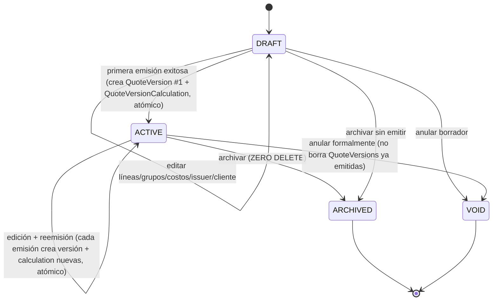
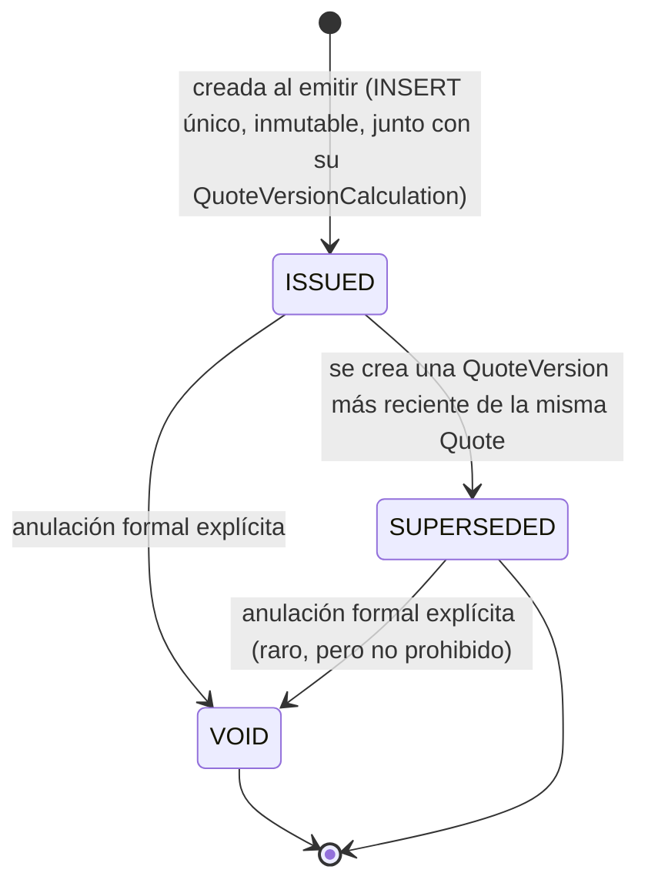

# LP-SCHEMA-001 — Contrato de Persistencia: Standalone Quote v1.3

Preparado por: SATHIA AI — LICITACIONES CORE (rol de ejecutor técnico, no Control Tower)
Fecha v1: 24-ago-2026 · Revisión v1.1: 24-ago-2026 · Revisión v1.2: 24-ago-2026 · Revisión v1.3: 24-ago-2026 (cierre quirúrgico de Control Tower sobre v1.2)
Estado: v1.3 — SOLO DISEÑO. No aplicado. No hay SQL real, Supabase, push, PR, merge ni deploy. Sin staging, sin commit.
Repositorio: `SantosBroking/LICITAPRO` · Branch base conceptual: `feat/licita-engine-v1`
HEAD remoto confirmado por Control Tower (motor publicado): `0421b8f28d075089320387d526c97d1f27adf764`
Motor financiero de referencia: `engine/src/pricingEngine.js` (suite 68/68 PASS, LP-ENG-002 → LP-ENG-002T)

> Este documento es un contrato de arquitectura de datos, no una migración. Ninguna tabla, tipo, política RLS o función SQL descrita aquí existe todavía. El objetivo es que una misión posterior (`LP-SCHEMA-002` o equivalente) pueda generar las migraciones reales a partir de este contrato, con la aprobación explícita de Control Tower.

---

## 0. Registro de cambios

### v1 → v1.1
DR1/DR2 cerradas; DR3 sustituida por separación física `quote_version`/`quote_version_calculation`; `pricing_group.pricing_mode` nullable; `pricing_group_cost_item` restringido por `cost_scope`; `quote_total_role`; `origin_kind` amplía a KIT; state model `DRAFT/ACTIVE/ARCHIVED/VOID`; `quote_header_snapshot`; correcciones de NUMERIC/precisión, folio, `work_item_id`, ownership/duplicidad, `cost_reference` RESTRICT, SHA remoto completo. Ver detalle en la versión anterior de este mismo archivo (historial de sesión).

### v1.1 → v1.2 (esta revisión — QA final)

1. **NUMERIC — corrección final:** eliminada la sugerencia `CHECK (value = value)` para excluir NaN (PostgreSQL trata `NaN = NaN` como verdadero para `numeric` — la sugerencia era incorrecta). El contrato ahora solo exige conceptualmente la exclusión de NaN/Infinity/-Infinity, deja el `CHECK` exacto a `LP-SCHEMA-002`. Corregida también la estrategia de escala: se elimina la recomendación de `numeric(18,6)` para captura humana (contradecía "nunca hay redondeo antes del motor", porque `numeric(p,s)` con escala fija SÍ redondea el input). v1.2 usa `numeric` sin escala coercitiva para todo monto/tasa que alimente el motor; una futura capa de producto podrá imponer límites, pero debe **rechazar**, no redondear silenciosamente.
2. **`quote_line` — campos comerciales mínimos agregados:** `commercial_description`, `technical_description`, `quantity`, `unit_label` — snapshots editables de trabajo, independientes del catálogo vivo.
3. **`line_status` ↔ `quote_total_role` — cerrado exactamente**, sin dejar blocker/warning como decisión futura. Semántica de "línea ancla" vs. "línea subordinada" por grupo.
4. **`pricing_mode` — checks compuestos completos**, incluyendo `sale_tax_treatment NOT NULL` para todo modo no nulo.
5. **`currency`** — criterio corregido a `^[A-Z]{3}$`, sin afirmar validación contra el catálogo oficial ISO 4217.
6. **Integridad PRODUCT/SERVICE/variant** — invariantes explícitos agregados.
7. **Third-party role consistency** — invariantes agregados (cliente CLIENT/BOTH, proveedor SUPPLIER/BOTH).
8. **`quote.client_contact_id`/`client_address_id`** agregados, con integridad compuesta hacia el mismo `third_party`.
9. **Folio** — agregado: `folio IS NOT NULL` implica `issuing_company_id IS NOT NULL`.
10. **`display_order`** — la unicidad aplica solo a filas `ACTIVE`, no bloquea reutilizar una posición archivada.
11. **`quote_version_calculation` — cardinalidad real corregida:** PK/FK garantiza "como máximo una", no "exactamente una" por sí sola; "exactamente una" es una regla de emisión atómica, no una propiedad estructural aislada.
12. **`quote_version.commercial_snapshot_schema_version`** agregado.
13. **JSONB "verbatim"** — corregido a "estructural/value-equivalent", sin exigir byte-identidad.
14. **Invariante de consistencia/concurrencia de emisión** agregado.
15. **Whitelist explícita para `commercial_lines_snapshot`** — nunca `to_jsonb(quote_line)` completo ni copia indiscriminada de `source_snapshot`.
16. **Columnas de auditoría — excepciones corregidas** para no contradecir inmutabilidad; `created_by` agregado a `quote_version_calculation` (faltaba en v1.1).
17. **Diagrama ER** — eliminada la relación visual `ISSUING_COMPANY → QUOTE_VERSION` (no es FK real, es snapshot).
18. **Referencias internas rotas corregidas** (`§17` → Anexo A punto 17, donde correspondía).
19. **DECISION_REQUIRED: sigue en CERO.**

### v1.2 → v1.3 (esta revisión — cierre quirúrgico)

1. **`pricing_group.quantity`** — invariante explícito: obligatoria y finita cuando `amount_basis='PER_UNIT'` (espejo de `resolveAmountByBasis` del motor); con `amount_basis='TOTAL'` puede existir como metadata, sin participar en la resolución de precio. Sin restricciones de signo adicionales no fijadas por el canon.
2. **`catalog_item`** — columna ambigua `description` eliminada; sustituida por `commercial_description`/`technical_description` (mismo patrón ya usado en `quote_line`), con `name` sin cambio (`NOT NULL`).
3. **`quote_line.free_text_label` eliminado** — `FREE_CONCEPT` usa exclusivamente `commercial_description` (ya `NOT NULL`) como fuente comercial; se elimina el campo de texto competidor.
4. **`cost_calculation_mode` — exclusividad de campos cerrada** para `DIRECT_AMOUNT`/`PERCENT_OF_SALE_NET`/`PERCENT_OF_SALE_GROSS` en ambas tablas de cost item.
5. **Ancla exacta al emitir** — de "máximo una" (DRAFT) a "**exactamente una**" para todo grupo con `pricing_mode IS NOT NULL` materialmente parte de una versión emitida.
6. **Main engine input no vacío** — invariante nuevo: la emisión exige al menos un `pricing_group` `INCLUDED` `ACTIVE`.
7. **`client_contact_id`/`client_address_id`** — agregada implicación explícita de columna (no solo FK compuesta): si están poblados, `client_third_party_id` debe estarlo.
8. **`internal_calculation_snapshot`** — precisado: debe preservar por cada grupo OPTIONAL/REFERENCE_ONLY su `pricing_group_id`, `engine input`/`engine output` propios y `quote_total_role` — no solo "el resultado".
9. Documentación/invariantes/Anexo A/migraciones actualizadas en consecuencia; ER sin nueva entidad, solo reflejo de columnas donde aplica.

---

## 1. Resumen ejecutivo

Standalone Quote v1.3 es el modelo de persistencia relacional mínimo y suficiente para que LicitaPro pueda crear, editar, calcular y emitir cotizaciones usando el motor financiero ya publicado (`pricingEngine.js`), sin depender del modelo legacy `projects.data jsonb` como arquitectura primaria y sin acoplarse a facturación, cobranza, inventario, licitaciones (tender workflow) o sincronización con Drive.

El diseño separa explícitamente tres capas que el governance de LICITACIONES CORE ya distingue como fronteras no negociables:

1. **Objetos estructurados y relaciones** (LicitaPro / esta base de datos): empresas emisoras, terceros, catálogo, referencias de costo, cotizaciones, grupos de pricing, líneas, versiones emitidas.
2. **Documentos y evidencia** (Drive): PDFs, imágenes, archivos pesados — enlazados por ID estable, nunca por ruta.
3. **Cálculo financiero** (el motor puro): el esquema persiste *inputs* y *outputs* del motor tal cual, nunca reimplementa sus fórmulas.

Decisiones centrales tras dos rondas de QA de Control Tower:

- **`PricingGroup` es una entidad de primera clase**, distinta de `QuoteLine`: el motor calcula por grupo, y una presentación consolidada puede tener varias líneas comerciales apuntando al mismo grupo económico, con una disciplina explícita de "línea ancla" vs. "líneas subordinadas" (§4.10/§4.11).
- **`Quote` es mutable (workspace vivo); `QuoteVersion` es inmutable** y solo se crea al emitir formalmente, mediante una operación atómica que congela todo el agregado a la vez (§14 nueva).
- **La frontera comercial/interna es física, no solo de política:** `quote_version` (snapshot comercial) y `quote_version_calculation` (contenido financiero interno, 1:1) son tablas distintas, construidas mediante whitelist explícita de campos comerciales — nunca serialización indiscriminada.
- **JSONB se usa deliberadamente** para snapshots inmutables y payloads de motor, con la precisión exacta de lo que "verbatim" significa: estructural/value-equivalent, no byte-identidad (corrección 13).
- **`ThirdParty`, `IssuingCompany` y `CostReference` nunca son sobrescritos ni sirven de fuente autoritativa retroactiva** de una `QuoteVersion` ya emitida.

**No quedan `DECISION_REQUIRED` abiertos** (sección 14 de puntos de decisión).

---

## 2. Scope / non-scope

### 2.1 Dentro de alcance (v1.3)

- `IssuingCompany` (BROKING, SATHRI; DRAFT puede tener issuer "por definir").
- `ThirdParty` (CLIENT / SUPPLIER / BOTH) con múltiples contactos y domicilios, con consistencia de rol exigida en cada uso (§11, corrección 7).
- `CatalogItem` unificado **exclusivamente para PRODUCT/SERVICE** (DR1 cerrada) y variantes opcionales, con integridad PRODUCT/SERVICE/variant explícita (§11, corrección 6).
- `CostReference` como fuente de costo fechada, no autoritativa.
- `Quote` mutable en estados DRAFT/ACTIVE, con `displayMode` (COMPONENT/CONSOLIDATED/MIXED), contacto/domicilio de cliente seleccionables (§4.8, corrección 8).
- `QuoteSection` (entidad de primera clase) y `QuoteLine`, con los cuatro estados de línea del canon, `origin_kind` que reconoce PRODUCT/SERVICE/KIT/SOLUTION/FREE_CONCEPT, y campos comerciales mínimos editables propios (§4.11, corrección 2).
- `PricingGroup` explícito, con sus `costItems` propios (ownership `GROUP_FINAL`), separación clara de los `saleBasedCostItems` de alcance-cotización (`QUOTE_LEVEL`), rol frente al agregado principal (`quote_total_role`), soporte de `pricing_mode IS NULL` (grupo de solo costo), y disciplina cerrada de línea ancla/subordinada por rol (§4.10, corrección 3).
- `QuoteVersion` inmutable (snapshot **comercial**, con versión de schema propia), creada solo al emitir.
- `QuoteVersionCalculation` inmutable (snapshot **interno**, 1:1 con `QuoteVersion` por regla de emisión — no solo por PK/FK, corrección 11).
- Puntos de extensión documentados hacia módulos futuros, sin construirlos.

### 2.2 Fuera de alcance (v1.3) — explícitamente NO diseñado aquí

`Invoice`, `Collection`, `Payment`, cuentas por cobrar/pagar, cashflow, contabilidad, acreditamiento fiscal definitivo (SAT), `PurchaseOrder`, `Receipt`, inventario, RFQ completo, `WorkItem` completo, `Project` completo, sincronización técnica con Drive, PDFs, UI, extracción por IA, flujo de licitación (tender workflow), *allocations*, RLS SQL definitivo, migración de datos legacy, masters formales de `Kit`/`Solution`, el `CHECK` SQL exacto de finitud numérica (diferido a `LP-SCHEMA-002`), el mecanismo concreto de control de concurrencia de emisión (diferido a `LP-SCHEMA-002`).

---

## 3. Diagrama ER (Mermaid)

```mermaid
erDiagram
    ISSUING_COMPANY ||--o{ QUOTE : "emite (o pendiente)"

    THIRD_PARTY ||--o{ THIRD_PARTY_CONTACT : tiene
    THIRD_PARTY ||--o{ THIRD_PARTY_ADDRESS : tiene
    THIRD_PARTY ||--o{ QUOTE : "cliente de (o pendiente)"
    THIRD_PARTY ||--o{ COST_REFERENCE : "origen/proveedor de (opcional, kind SUPPLIER/BOTH)"

    CATALOG_ITEM ||--o{ CATALOG_ITEM_VARIANT : tiene
    CATALOG_ITEM ||--o{ QUOTE_LINE : "origina (solo PRODUCT/SERVICE)"
    CATALOG_ITEM ||--o{ COST_REFERENCE : "referencia costo de (opcional)"

    QUOTE ||--o{ QUOTE_SECTION : contiene
    QUOTE ||--o{ PRICING_GROUP : define
    QUOTE ||--o{ QUOTE_SALE_BASED_COST_ITEM : declara
    QUOTE ||--o{ QUOTE_LINE : "identidad denormalizada (integridad cross-quote)"
    QUOTE ||--o{ QUOTE_VERSION : "emite (append-only)"

    QUOTE_SECTION ||--o{ QUOTE_LINE : contiene

    PRICING_GROUP ||--o{ QUOTE_LINE : "es precio de (1 grupo : N líneas, ancla + subordinadas)"
    PRICING_GROUP ||--o{ PRICING_GROUP_COST_ITEM : "posee (GROUP_FINAL)"

    COST_REFERENCE ||--o{ PRICING_GROUP_COST_ITEM : "sugiere (no autoritativo, RESTRICT)"
    COST_REFERENCE ||--o{ QUOTE_SALE_BASED_COST_ITEM : "sugiere (no autoritativo, RESTRICT)"

    QUOTE_VERSION ||--|| QUOTE_VERSION_CALCULATION : "1:1 por regla de emisión (no solo PK/FK)"

    QUOTE_VERSION {
        uuid id PK
        uuid quote_id FK
        int version_number
        text commercial_snapshot_schema_version
        jsonb quote_header_snapshot
        jsonb issuer_snapshot
        jsonb client_snapshot
        jsonb commercial_lines_snapshot
        jsonb terms_snapshot
        text status
    }

    QUOTE_VERSION_CALCULATION {
        uuid quote_version_id PK_FK
        jsonb engine_input
        jsonb engine_output
        jsonb internal_calculation_snapshot
        text engine_commit_sha
        text engine_contract_version
        text calculation_schema_version
    }
```

**Corrección 17 (vinculante):** se elimina la relación visual `ISSUING_COMPANY → QUOTE_VERSION` presente en v1.1 — `issuer_snapshot` es un atributo JSONB copiado por valor dentro de `quote_version`, no una relación viva ni una FK real hacia `issuing_company`. El diagrama no debe mostrar como arista relacional algo que el modelo deliberadamente no implementa como FK. Lo mismo aplica a `client_snapshot`: se describe como atributo (columna de `QUOTE_VERSION`), nunca como arista desde `THIRD_PARTY`. Las únicas relaciones vivas de `QUOTE_VERSION` en el diagrama son `QUOTE → QUOTE_VERSION` (FK real, `quote_id`) y `QUOTE_VERSION → QUOTE_VERSION_CALCULATION` (FK real, `quote_version_id`).

*(El diagrama omite atributos exhaustivos por legibilidad — están completos en la sección 4.)*

---

## 4. Tablas por entidad

Convenciones generales:

- `id UUID PRIMARY KEY DEFAULT gen_random_uuid()` en toda entidad — nunca una clave natural como PK.
- Ninguna tabla de dominio tiene `DELETE` como operación soportada por la aplicación (ver §12, ZERO DELETE). `ARCHIVED` **nunca** equivale a `DELETE`.
- Los enums del motor se replican como `CHECK` sobre columnas `text`, nunca `ENUM` nativo de PostgreSQL.
- **`currency` (corrección 5, sustituye el criterio de v1.1):** formato canónico `CHECK (currency ~ '^[A-Z]{3}$')`. Esto es **solo forma canónica ISO-4217-like** — no valida contra el catálogo oficial de códigos ISO 4217 vigentes (eso requeriría una tabla de referencia de monedas, fuera de alcance de v1.3). El motor sigue sin soporte de conversión de divisas (FX) — una sola moneda por `quote`, sin conversión.
- **Precisión monetaria (corrección 1, reemplaza la convención de v1.1):** todo campo `numeric` que represente un monto o tasa que eventualmente alimenta al motor se declara como `numeric` **sin escala fija (`p,s`) coercitiva** en este contrato base — nunca `numeric(18,6)` como tipo impuesto por esta capa. Motivo: `numeric(p,s)` en PostgreSQL **redondea** un valor de entrada que exceda la escala declarada; afirmar simultáneamente "acepta captura humana con `numeric(18,6)`" y "nunca hay redondeo antes del motor" es una contradicción, y se elimina. Una futura capa de producto podrá imponer límites prácticos de precisión, pero deberá **rechazar** (error de validación) un input fuera de política, nunca redondearlo silenciosamente antes de que llegue al motor. El orquestador es responsable de: convertir explícitamente `numeric` (decimal exacto de PostgreSQL) → `Number` de JavaScript, validar `Number.isFinite` tras la conversión, invocar al motor, y congelar en `engine_input` el valor estructurado **efectivamente enviado al motor** (después de la conversión, no antes).
- **Finitud (corrección 1):** todo campo financiero persistente debe excluir conceptualmente `NaN`/`Infinity`/`-Infinity` cuando el tipo subyacente pueda representarlos (PostgreSQL `numeric` puede admitirlos — ver Anexo A punto 17). **No se especifica aquí** el `CHECK` SQL exacto — la sugerencia de v1.1 (`CHECK (value = value)`) era **incorrecta**, porque PostgreSQL trata `NaN = NaN` como verdadero para `numeric` (a diferencia de IEEE-754 en JavaScript, donde `NaN !== NaN`), así que esa expresión nunca descarta un NaN. El `CHECK` exacto (verosímilmente comparando contra las representaciones textuales `'NaN'`, `'Infinity'`, `'-Infinity'`, o validación en la capa de aplicación) se decide en `LP-SCHEMA-002`. El motor sigue siendo la autoridad final de finitud vía `Number.isFinite` (68/68 PASS ya lo garantiza en su propia salida).

### 4.1 `issuing_company`

| Columna | Tipo lógico | Nullable | FK | Unique/Check | Explicación |
|---|---|---|---|---|---|
| `id` | uuid | NO | — | PK | — |
| `code` | text | NO | — | UNIQUE, CHECK `code IN ('BROKING','SATHRI')` | Set cerrado v1.3. |
| `legal_name` | text | NO | — | — | Vigente al momento de consulta — histórico vive en snapshot. |
| `tax_id` | text | YES | — | — | Informativo. |
| `status` | text | NO | — | CHECK `status IN ('ACTIVE','ARCHIVED')` | ZERO DELETE. |
| `created_at`/`updated_at`/`created_by`/`updated_by` | — | — | — | — | Tabla mutable — convención estándar completa (§16 corrección: tablas mutables llevan las cuatro columnas). |

### 4.2 `third_party`

| Columna | Tipo lógico | Nullable | FK | Unique/Check | Explicación |
|---|---|---|---|---|---|
| `id` | uuid | NO | — | PK | — |
| `kind` | text | NO | — | CHECK `kind IN ('CLIENT','SUPPLIER','BOTH')` | Rol funcional del tercero — ver consistencia de uso en §11 (corrección 7). |
| `display_name` | text | NO | — | — | — |
| `legal_name` | text | YES | — | — | — |
| `tax_id` | text | YES | — | INDEX (no UNIQUE) | Ayuda a deduplicar, nunca PK/UNIQUE. |
| `merged_into_id` | uuid | YES | → `third_party.id` | CHECK `merged_into_id IS NULL OR merged_into_id <> id` | ZERO DELETE — fusión sin borrado. |
| `status` | text | NO | — | CHECK `status IN ('ACTIVE','ARCHIVED','MERGED')` | — |
| `created_at`/`updated_at`/`created_by`/`updated_by` | — | — | — | — | Tabla mutable — estándar completo. |

### 4.3 `third_party_contact`

| Columna | Tipo lógico | Nullable | FK | Unique/Check | Explicación |
|---|---|---|---|---|---|
| `id` | uuid | NO | — | PK | — |
| `third_party_id` | uuid | NO | → `third_party.id` | — | — |
| `full_name` | text | NO | — | — | — |
| `role_label` | text | YES | — | — | Texto libre v1.3. |
| `email` | text | YES | — | — | — |
| `phone` | text | YES | — | — | — |
| `is_primary` | boolean | NO | DEFAULT false | — | Candidato a `UNIQUE (third_party_id) WHERE is_primary` en migración real. |
| `status` | text | NO | — | CHECK `status IN ('ACTIVE','ARCHIVED')` | ZERO DELETE. |

### 4.4 `third_party_address`

| Columna | Tipo lógico | Nullable | FK | Unique/Check | Explicación |
|---|---|---|---|---|---|
| `id` | uuid | NO | — | PK | — |
| `third_party_id` | uuid | NO | → `third_party.id` | — | — |
| `address_kind` | text | YES | — | — | Texto libre. |
| `line1`/`line2`/`city`/`state`/`postal_code`/`country` | text | YES (según campo) | — | — | Sin normalización geográfica en v1.3. |
| `status` | text | NO | — | CHECK `status IN ('ACTIVE','ARCHIVED')` | ZERO DELETE. |

### 4.5 `catalog_item` *(DR1 cerrada — unificado, solo PRODUCT/SERVICE)*

| Columna | Tipo lógico | Nullable | FK | Unique/Check | Explicación |
|---|---|---|---|---|---|
| `id` | uuid | NO | — | PK | — |
| `kind` | text | NO | — | CHECK `kind IN ('PRODUCT','SERVICE')` | Cerrado — `KIT`/`SOLUTION` NO son valores válidos aquí. |
| `sku` | text | YES | — | UNIQUE (parcial, `WHERE sku IS NOT NULL`) | — |
| `name` | text | NO | — | — | — |
| `commercial_description` | text | YES | — | — | **Sustituye `description` (corrección 2, v1.3).** Descripción comercial del master — precarga `quote_line.commercial_description` al insertar una línea desde catálogo, pero la línea es editable e independiente después. |
| `technical_description` | text | YES | — | — | **Nueva (corrección 2, v1.3).** Detalle técnico del master — precarga `quote_line.technical_description`, mismo patrón. |
| `default_unit_label` | text | YES | — | — | Informativo, no usado por el motor. |
| `status` | text | NO | — | CHECK `status IN ('ACTIVE','ARCHIVED')` | ZERO DELETE. |

### 4.6 `catalog_item_variant`

| Columna | Tipo lógico | Nullable | FK | Unique/Check | Explicación |
|---|---|---|---|---|---|
| `id` | uuid | NO | — | PK | — |
| `catalog_item_id` | uuid | NO | → `catalog_item.id` | — | — |
| `variant_label` | text | NO | — | — | — |
| `attributes` | jsonb | YES | — | — | Metadata libre de dominio (marca/modelo/versión). |
| `status` | text | NO | — | CHECK `status IN ('ACTIVE','ARCHIVED')` | ZERO DELETE. |

### 4.7 `cost_reference`

| Columna | Tipo lógico | Nullable | FK | Unique/Check | Explicación |
|---|---|---|---|---|---|
| `id` | uuid | NO | — | PK | — |
| `catalog_item_id` | uuid | YES | → `catalog_item.id` | — | Opcional. |
| `supplier_third_party_id` | uuid | YES | → `third_party.id` | CHECK cruzado: el `third_party` referenciado debe tener `kind IN ('SUPPLIER','BOTH')` (corrección 7) | Un `CLIENT` puro no puede figurar como origen de un costo de referencia. |
| `amount` | numeric | NO | — | requerido, ver preámbulo §4 sobre precisión/finitud | Sin escala fija impuesta por este contrato (corrección 1). |
| `currency` | text | NO | — | CHECK `^[A-Z]{3}$` (corrección 5) | — |
| `tax_treatment` | text | NO | — | CHECK ∈ `{IVA_INCLUDED,IVA_ADDITIONAL,ZERO_RATE,EXEMPT,UNKNOWN}` | — |
| `tax_rate` | numeric | YES | — | CHECK `tax_rate IS NULL OR tax_rate >= 0` | — |
| `documentation_status` | text | NO | — | CHECK ∈ `{DOCUMENTED,NOT_DOCUMENTED,UNCONFIRMED}` | — |
| `observed_at` | date | NO | — | — | Hecho fechado, nunca actualizado in-place. |
| `notes` | text | YES | — | — | — |
| `status` | text | NO | — | CHECK `status IN ('ACTIVE','ARCHIVED')` | ZERO DELETE. |
| `created_at`/`updated_at`/`created_by`/`updated_by` | — | — | — | — | Tabla mutable (nuevas observaciones son filas nuevas; el registro en sí puede archivarse) — estándar completo. |

**Nota canónica sin cambio:** ningún costo autoritativo único vive en `catalog_item`/`catalog_item_variant`. Todo costo vive en `cost_reference` (histórico) o `pricing_group_cost_item` (capturado en cotización).

**Vínculos hacia `cost_reference` (sin cambio v1.1):** `ON DELETE RESTRICT`/`NO ACTION` desde `pricing_group_cost_item`/`quote_sale_based_cost_item`, nunca `SET NULL` — preserva trazabilidad del vínculo, no solo el registro.

### 4.8 `quote`

| Columna | Tipo lógico | Nullable | FK | Unique/Check | Explicación |
|---|---|---|---|---|---|
| `id` | uuid | NO | — | PK | — |
| `folio` | text | YES | — | UNIQUE conceptual `(issuing_company_id, folio)` cuando `folio IS NOT NULL`; CHECK `folio IS NULL OR issuing_company_id IS NOT NULL` (**corrección 9, nueva**) | Un folio pertenece siempre a un emisor conocido — no puede existir folio sin emisor asignado. |
| `issuing_company_id` | uuid | YES | → `issuing_company.id` | — | Nullable en DRAFT; `NOT NULL` exigido antes de `ACTIVE` (§6). |
| `client_third_party_id` | uuid | YES | → `third_party.id` | CHECK cruzado: `kind IN ('CLIENT','BOTH')` (corrección 7) | Nullable en DRAFT temprano; obligatorio antes de `ACTIVE`. Un `SUPPLIER` puro no puede ser cliente de una cotización. |
| `client_contact_id` | uuid | YES | → `third_party_contact.id` | integridad compuesta `(client_third_party_id, client_contact_id)` → `third_party_contact(third_party_id, id)`; **CHECK `client_contact_id IS NULL OR client_third_party_id IS NOT NULL`** (corrección 7, v1.3 — explícito a nivel de columna, no solo implícito en la FK compuesta) | Selección explícita de contacto para esta cotización — opcional durante captura; si se declara, debe pertenecer al mismo `client_third_party_id`. Nunca se elige "el primario" silenciosamente en emisión. |
| `client_address_id` | uuid | YES | → `third_party_address.id` | integridad compuesta `(client_third_party_id, client_address_id)` → `third_party_address(third_party_id, id)`; **CHECK `client_address_id IS NULL OR client_third_party_id IS NOT NULL`** (corrección 7, v1.3) | Igual disciplina que `client_contact_id`. |
| `reference_label` | text | YES | — | — | — |
| `currency` | text | NO | — | CHECK `^[A-Z]{3}$` | Moneda única de toda la cotización. |
| `valid_until` | date | YES | — | — | — |
| `display_mode` | text | NO | — | CHECK ∈ `{COMPONENT_PRICING,CONSOLIDATED_PRICING,MIXED_PRICING}` | — |
| `status` | text | NO | — | CHECK ∈ `{DRAFT,ACTIVE,ARCHIVED,VOID}` | Ver §6. |
| `terms_text` | text | YES | — | — | Congelado en `quote_version.terms_snapshot`. |
| `created_at`/`updated_at`/`created_by`/`updated_by` | — | — | — | — | Tabla mutable — estándar completo. |

*(`work_item_id` sigue sin columna física — extension point documentado, §13.)*

### 4.9 `quote_section`

| Columna | Tipo lógico | Nullable | FK | Unique/Check | Explicación |
|---|---|---|---|---|---|
| `id` | uuid | NO | — | PK | — |
| `quote_id` | uuid | NO | → `quote.id` | — | — |
| `label` | text | NO | — | — | — |
| `display_order` | integer | NO | — | UNIQUE conceptual **entre filas `ACTIVE`** `(quote_id, display_order) WHERE status='ACTIVE'` (**corrección 10**, sustituye la unicidad incondicional de v1.1) | Archivar una sección libera su posición para ser reutilizada por otra sección `ACTIVE` — la unicidad no debe impedirlo. |
| `status` | text | NO | — | CHECK `status IN ('ACTIVE','ARCHIVED')` | ZERO DELETE. |
| `created_at`/`updated_at`/`created_by`/`updated_by` | — | — | — | — | Tabla mutable — estándar completo. |

### 4.10 `pricing_group`

| Columna | Tipo lógico | Nullable | FK | Unique/Check | Explicación |
|---|---|---|---|---|---|
| `id` | uuid | NO | — | PK | — |
| `quote_id` | uuid | NO | → `quote.id` | — | Pertenece a la `quote`, no a una `quote_section`. |
| `quantity` | numeric | YES | — | **NOT NULL y finita cuando `amount_basis='PER_UNIT'`** (v1.3, corrección 1) | Espejo de `group.quantity`. `resolveAmountByBasis` del motor exige `quantity` finita cuando `amountBasis=PER_UNIT` — este `CHECK` compuesto lo refleja. Con `amount_basis='TOTAL'`, `quantity` puede existir como metadata/contexto, pero no participa en esa resolución de precio. Sin restricciones de signo adicionales no fijadas por el canon. |
| `pricing_mode` | text | YES | — | ver checks completos abajo (corrección 4) | `NULL` = grupo de solo costo. |
| `amount_basis` | text | YES | — | ver checks completos abajo | — |
| `profit_target_basis` | text | YES | — | ver checks completos abajo | — |
| `pricing_value` | numeric | YES | — | ver checks completos abajo | Sin escala fija impuesta (corrección 1). |
| `sale_tax_treatment` | text | YES | — | ver checks completos abajo | — |
| `sale_tax_rate` | numeric | YES | — | CHECK `sale_tax_rate IS NULL OR sale_tax_rate >= 0` | Nullable cuando el motor lo permite; si existe, debe ser financiero válido/finito/no negativo según el `CHECK` exacto de `LP-SCHEMA-002`. |
| `quote_total_role` | text | NO | — | CHECK ∈ `{INCLUDED,OPTIONAL,REFERENCE_ONLY}` | Determina participación en el agregado principal del motor. |
| `currency` | text | NO | — | CHECK `^[A-Z]{3}$`, debe igualar `quote.currency` (trigger) | — |
| `status` | text | NO | — | CHECK `status IN ('ACTIVE','ARCHIVED')` | ZERO DELETE. Un `pricing_group` de solo costo/interno puede existir sin ninguna `quote_line`. |
| `created_at`/`updated_at`/`created_by`/`updated_by` | — | — | — | — | Tabla mutable — estándar completo. |

**Checks compuestos completos por `pricing_mode` (corrección 4, sustituye íntegramente el resumen de v1.1):**

| `pricing_mode` | `amount_basis` | `profit_target_basis` | `pricing_value` | `sale_tax_treatment` |
|---|---|---|---|---|
| `NULL` (solo costo) | NULL | NULL | NULL | NULL |
| `MARKUP_ON_COST` | NULL | NULL | NOT NULL | **NOT NULL** |
| `PRICE_DIRECT` | `IN (PER_UNIT,TOTAL)`, NOT NULL | NULL | NOT NULL | **NOT NULL** |
| `TARGET_PROFIT_AMOUNT` | `IN (PER_UNIT,TOTAL)`, NOT NULL | NULL o uno de `{BASE_COST_BEFORE_SALE_BASED_COSTS,FINAL_AFTER_KNOWN_COSTS}` | NOT NULL | **NOT NULL** |
| `BUDGET_CEILING` | `= TOTAL`, NOT NULL | NULL | NOT NULL | **NOT NULL** |

`sale_tax_treatment NOT NULL` para **todo** modo distinto de `NULL` es la corrección explícita respecto a v1.1 (que no lo exigía uniformemente) — un grupo con precio siempre debe declarar tratamiento fiscal de venta, incluso si es `UNKNOWN`.

**Semántica cerrada `line_status` ↔ `quote_total_role` (corrección 3, sustituye la formulación abierta de v1.1 — ya NO es "decisión de producto futura", es regla vinculante):**

| `pricing_group.quote_total_role` | Línea(s) ancla admitida(s) (DRAFT) | Línea(s) ancla exigida (EMISIÓN — corrección 5, v1.3) | Línea(s) subordinada(s) admitida(s) | Prohibido |
|---|---|---|---|---|
| `INCLUDED` | como máximo **una** `PRICED` | **exactamente una** `PRICED` ACTIVE | `INCLUDED` (cualquier cantidad) | `OPTIONAL`; `REFERENCE_NOT_INCLUDED` con grupo asignado |
| `OPTIONAL` | como máximo **una** `OPTIONAL` | **exactamente una** `OPTIONAL` ACTIVE | `INCLUDED` (cualquier cantidad) | `PRICED`; `REFERENCE_NOT_INCLUDED` |
| `REFERENCE_ONLY` | como máximo **una** `REFERENCE_NOT_INCLUDED` | **exactamente una** `REFERENCE_NOT_INCLUDED` ACTIVE | `INCLUDED` (cualquier cantidad) | `PRICED`; `OPTIONAL` |

- **Línea ancla:** la única línea de un grupo cuyo `line_status` refleja directamente el rol de precio del grupo (`PRICED` para `INCLUDED`, `OPTIONAL` para `OPTIONAL`, `REFERENCE_NOT_INCLUDED` para `REFERENCE_ONLY`). **Un grupo con precio no puede tener más de una línea ancla** — evita ambigüedad sobre "cuál línea representa el precio del grupo".
- **Línea subordinada:** cualquier línea adicional del mismo grupo con `line_status='INCLUDED'` — es un componente presentacional cuyo costo/precio ya está absorbido dentro del precio único del grupo (principal, opcional o de referencia), sin ancla propia.
- Una línea `REFERENCE_NOT_INCLUDED` puramente informativa **puede** tener `pricing_group_id = NULL` (no requiere grupo si no hay cálculo detrás).
- Una línea `OPTIONAL` puede estar temporalmente sin grupo durante `DRAFT` (captura incremental), pero **no puede formar parte de una emisión** como opción cotizada sin `pricing_group_id` poblado — se aplica en la transición `DRAFT → ACTIVE`/reemisión, no como `NOT NULL` de columna.
- Estas combinaciones se aplican por `CHECK`/validación de aplicación que cruza `quote_line.line_status` y `pricing_group.quote_total_role` — no expresable como `CHECK` de columna simple porque cruza tablas, pero es **vinculante**, no una recomendación.

**Ancla exacta al emitir (corrección 5, v1.3, vinculante — fortalece la regla de "máximo una" de v1.2):** durante `DRAFT` puede existir estado incompleto (un grupo con precio sin ancla todavía, mientras se captura). Pero una **emisión válida** exige que, si `pricing_group.pricing_mode IS NOT NULL` y ese grupo es materialmente parte de la versión emitida (participa del cálculo principal `INCLUDED`, o de un cálculo `OPTIONAL`/`REFERENCE_ONLY` preservado en `internal_calculation_snapshot`), exista **exactamente una** línea ancla `ACTIVE` correspondiente a su `quote_total_role` (una `PRICED` para `INCLUDED`, una `OPTIONAL` para `OPTIONAL`, una `REFERENCE_NOT_INCLUDED` para `REFERENCE_ONLY`) — nunca cero, nunca más de una. Puede haber N líneas subordinadas `INCLUDED` adicionales sin límite. Un `pricing_group` con `pricing_mode IS NULL` (solo costo/interno) puede existir sin ninguna `quote_line` en cualquier momento, incluida la emisión. Esta regla existe para que **no se permitan ventas calculadas ocultas** — un grupo con precio que se calculó y se incluyó en una versión emitida sin ninguna línea comercial que lo represente ante el cliente/usuario es una configuración inválida, verificada en la transición `DRAFT → ACTIVE`/reemisión, no como `CHECK` de columna.

**Main engine input no vacío (corrección 6, v1.3, invariante de emisión nuevo):** antes de invocar `computeQuoteCanonical`, el cálculo principal debe tener **al menos un** `pricing_group` `ACTIVE` con `quote_total_role='INCLUDED'` — `aggregateQuote` en el motor requiere al menos un grupo, y grupos `OPTIONAL`/`REFERENCE_ONLY` por sí solos **no constituyen** el agregado principal de una cotización v1. Una `quote` que solo tenga grupos `OPTIONAL`/`REFERENCE_ONLY` (o ningún grupo `ACTIVE`) no puede transicionar a `ACTIVE`/reemitirse hasta que exista al menos un grupo `INCLUDED`.

### 4.11 `quote_line`

| Columna | Tipo lógico | Nullable | FK | Unique/Check | Explicación |
|---|---|---|---|---|---|
| `id` | uuid | NO | — | PK | — |
| `quote_id` | uuid | NO | → `quote.id` | — | Denormalizado — integridad cross-quote (§ igual que v1.1). |
| `quote_section_id` | uuid | NO | → `quote_section.id` | FK compuesta `(quote_id, quote_section_id)` → `quote_section(quote_id, id)` | — |
| `pricing_group_id` | uuid | YES | → `pricing_group.id` | FK compuesta `(quote_id, pricing_group_id)` → `pricing_group(quote_id, id)`; nulidad exacta por `line_status` (§4.10) | — |
| `origin_kind` | text | NO | — | CHECK ∈ `{PRODUCT,SERVICE,KIT,SOLUTION,FREE_CONCEPT}` | — |
| `catalog_item_id` | uuid | YES | → `catalog_item.id` | ver integridad PRODUCT/SERVICE abajo (corrección 6) | — |
| `catalog_item_variant_id` | uuid | YES | → `catalog_item_variant.id` | ver integridad PRODUCT/SERVICE abajo | — |
| `source_snapshot` | jsonb | YES | — | requerido si `origin_kind IN ('KIT','SOLUTION')` | Trazabilidad de origen — **nunca** copiado directamente a `commercial_lines_snapshot` (corrección 15); puede contener metadata interna futura no apta para exposición comercial. |
| `commercial_description` | text | **NO** | — | — | **Nueva (corrección 2).** Descripción comercial editable de la línea — snapshot de trabajo independiente del `catalog_item`/`source_snapshot` de origen. Una vez insertada una línea desde catálogo, el usuario puede ajustar esta descripción sin modificar el `CatalogItem` maestro. **Una cotización emitida nunca se reconstruye desde el catálogo vivo** — este campo es la fuente comercial real. |
| `technical_description` | text | YES | — | — | **Nueva (corrección 2).** Detalle técnico editable, opcional. |
| `quantity` | numeric | **NO** | — | debe ser finita y `> 0` para que la línea sea emitible (validación de aplicación en transición a emisión) | **Nueva (corrección 2).** Cantidad comercial de la línea — independiente de `pricing_group.quantity` (que es la cantidad del grupo económico; pueden coincidir o no según cómo se arme la presentación). |
| `unit_label` | text | YES | — | — | **Nueva (corrección 2).** Ej. "pieza", "servicio", "mes" — informativo, puede diferir de `catalog_item.default_unit_label` si el usuario lo ajustó. |
| `line_status` | text | NO | — | CHECK ∈ `{PRICED,INCLUDED,OPTIONAL,REFERENCE_NOT_INCLUDED}`; combinación válida con `quote_total_role` del grupo (§4.10) | — |
| `display_order` | integer | NO | — | UNIQUE conceptual **entre filas `ACTIVE`** `(quote_section_id, display_order) WHERE status='ACTIVE'` (corrección 10) | — |
| `status` | text | NO | — | CHECK `status IN ('ACTIVE','ARCHIVED')` | ZERO DELETE. |
| `created_at`/`updated_at`/`created_by`/`updated_by` | — | — | — | — | Tabla mutable — estándar completo. |

**Integridad PRODUCT/SERVICE/variant (corrección 6, nueva, vinculante):**

- Si `origin_kind = 'PRODUCT'`: `catalog_item_id`, si está poblado, debe apuntar a un `catalog_item` con `kind = 'PRODUCT'`.
- Si `origin_kind = 'SERVICE'`: `catalog_item_id`, si está poblado, debe apuntar a un `catalog_item` con `kind = 'SERVICE'`.
- Si `catalog_item_variant_id IS NOT NULL`: entonces `catalog_item_id` también debe ser `NOT NULL`; la variante debe pertenecer exactamente a ese `catalog_item_id` (ya exigido en v1.1, §4.6); y `origin_kind` debe ser `PRODUCT` o `SERVICE` (una variante nunca aplica a KIT/SOLUTION/FREE_CONCEPT).
- Si `origin_kind IN ('KIT','SOLUTION','FREE_CONCEPT')`: `catalog_item_id` y `catalog_item_variant_id` deben ser **ambos NULL** en este contrato v1.3 — el único puente de trazabilidad para KIT/SOLUTION es `source_snapshot` (§2.2, masters formales fuera de alcance).

**`free_text_label` eliminado (corrección 3, v1.3, vinculante):** v1.2 mantenía `quote_line.free_text_label` como campo de texto libre para `FREE_CONCEPT`, compitiendo con `commercial_description` (agregado en la misma v1.2) para representar el mismo concepto. Se elimina `free_text_label` de todo el contrato. Para `origin_kind='FREE_CONCEPT'`, la única fuente comercial es `quote_line.commercial_description` (ya `NOT NULL` — §4.11). Regla exacta para `FREE_CONCEPT`: `catalog_item_id` NULL, `catalog_item_variant_id` NULL, `commercial_description` NOT NULL (sin excepción — ya lo es para toda fila de `quote_line` por definición de columna).

*(Regla de nulidad de `pricing_group_id` por `line_status`: sin cambio respecto a v1.1, ahora referenciada también desde la tabla de §4.10.)*

### 4.12 `pricing_group_cost_item` (ownership `GROUP_FINAL`)

Sin cambios estructurales respecto a v1.1 salvo precisión numérica (corrección 1 — `amount`/`rate` sin escala fija impuesta) y columnas de auditoría (tabla mutable — estándar completo).

| Columna | Tipo lógico | Nullable | FK | Unique/Check | Explicación |
|---|---|---|---|---|---|
| `id` | uuid | NO | — | PK | — |
| `pricing_group_id` | uuid | NO | → `pricing_group.id` | — | — |
| `cost_scope` | text | NO | — | CHECK ∈ `{GROUP_BASE_COST,GROUP_KNOWN_SALE_BASED_COST}` | — |
| `cost_calculation_mode` | text | NO | — | `GROUP_BASE_COST` → solo `DIRECT_AMOUNT`; `GROUP_KNOWN_SALE_BASED_COST` → los tres modos | Sin cambio v1.1. |
| `amount` | numeric | YES | — | ver checks de exclusividad completos abajo (corrección 4, v1.3) | Sin escala fija impuesta (corrección 1). |
| `quantity` | numeric | YES | — | ver checks de exclusividad completos abajo | Solo tiene efecto si `quantity_mode='PER_UNIT'`; si está declarada, debe ser finita. |
| `quantity_mode` | text | YES | — | ver checks de exclusividad completos abajo | CHECK ∈ `{PER_UNIT,PER_LOT,FIXED_TOTAL}`. |
| `rate` | numeric | YES | — | ver checks de exclusividad completos abajo | Sin escala fija impuesta. |
| `cost_role` | text | NO | — | CHECK ∈ `{LINE_BACKING,INTERNAL_ONLY}` | — |
| `tax_treatment` | text | NO | — | CHECK ∈ `{IVA_INCLUDED,IVA_ADDITIONAL,ZERO_RATE,EXEMPT,UNKNOWN}` | — |
| `tax_rate` | numeric | YES | — | CHECK `IS NULL OR >= 0` | — |
| `documentation_status` | text | NO | — | CHECK ∈ `{DOCUMENTED,NOT_DOCUMENTED,UNCONFIRMED}` | — |
| `currency` | text | NO | — | igual a `pricing_group.currency` (trigger) | — |
| `source_cost_reference_id` | uuid | YES | → `cost_reference.id`, `ON DELETE RESTRICT` | — | — |
| `status` | text | NO | — | CHECK `status IN ('ACTIVE','ARCHIVED')` | ZERO DELETE. |
| `created_at`/`updated_at`/`created_by`/`updated_by` | — | — | — | — | Tabla mutable — estándar completo. |

**Exclusividad de campos por `cost_calculation_mode` (corrección 4, v1.3, vinculante — aplica idénticamente en esta tabla y en `quote_sale_based_cost_item`, §4.13):**

| `cost_calculation_mode` | `amount` | `quantity_mode` | `quantity` | `rate` |
|---|---|---|---|---|
| `DIRECT_AMOUNT` | **NOT NULL** | **NOT NULL** | solo tiene efecto si `quantity_mode='PER_UNIT'`; si está declarada, debe ser finita; el mapper hacia el motor (§9) conserva la semántica de `quantity` omitida tal como el motor la interpreta (no se inventa un default distinto en la DB) | NULL |
| `PERCENT_OF_SALE_NET` | NULL | NULL | NULL | **NOT NULL** |
| `PERCENT_OF_SALE_GROSS` | NULL | NULL | NULL | **NOT NULL** |

Se mantiene sin cambio la restricción por `cost_scope`: `GROUP_BASE_COST` solo `DIRECT_AMOUNT`; `GROUP_KNOWN_SALE_BASED_COST` puede usar los tres modos. No se reimplementan fórmulas en SQL.

### 4.13 `quote_sale_based_cost_item` (ownership `QUOTE_LEVEL`)

Sin cambios estructurales respecto a v1.1 salvo precisión numérica (corrección 1) y auditoría estándar.

| Columna | Tipo lógico | Nullable | FK | Unique/Check | Explicación |
|---|---|---|---|---|---|
| `id` | uuid | NO | — | PK | — |
| `quote_id` | uuid | NO | → `quote.id` | — | — |
| `cost_calculation_mode` | text | NO | — | los tres modos válidos aquí | — |
| `amount` / `quantity` / `quantity_mode` / `rate` / `cost_role` / `tax_treatment` / `tax_rate` / `documentation_status` / `currency` | — | — | — | mismos tipos/checks que §4.12, sin escala fija en `amount`/`rate` | — |
| `source_cost_reference_id` | uuid | YES | → `cost_reference.id`, `ON DELETE RESTRICT` | — | — |
| `status` | text | NO | — | CHECK `status IN ('ACTIVE','ARCHIVED')` | ZERO DELETE. |
| `created_at`/`updated_at`/`created_by`/`updated_by` | — | — | — | — | Tabla mutable — estándar completo. |

**Invariante de ownership y corrección de duplicidad:** sin cambio de fondo respecto a v1.1 (§4.13 de esa versión) — el guard `FINAL_TARGET_WITH_UNALLOCATED_QUOTE_LEVEL_COSTS` permanece amplio y vinculante; las dos tablas separan destino de ownership sin detectar duplicación semántica manual por matching heurístico.

### 4.14 `quote_version` (inmutable — **snapshot exclusivamente comercial**)

| Columna | Tipo lógico | Nullable | FK | Unique/Check | Explicación |
|---|---|---|---|---|---|
| `id` | uuid | NO | — | PK | — |
| `quote_id` | uuid | NO | → `quote.id` | — | — |
| `version_number` | integer | NO | — | UNIQUE `(quote_id, version_number)` | Asignado transaccionalmente (§11, invariante de concurrencia). |
| `commercial_snapshot_schema_version` | text | **NO** | — | — | **Nueva (corrección 12).** Ej. `v1` — versión de interpretación de `quote_header_snapshot`/`issuer_snapshot`/`client_snapshot`/`commercial_lines_snapshot`/`terms_snapshot`, **independiente** de `calculation_schema_version` (que versiona el lado interno en `quote_version_calculation`). Ambos lados del snapshot evolucionan por separado. |
| `quote_header_snapshot` | jsonb | NO | — | — | Folio, moneda, vigencia, `display_mode`, etc. — persistencia estructural/value-equivalent del encabezado (corrección 13: no se exige byte-identidad). |
| `issuer_snapshot` | jsonb | NO | — | — | Atributo de copia — **no** una relación FK hacia `issuing_company` (corrección 17). |
| `client_snapshot` | jsonb | NO | — | — | Copia congelada del cliente **y del contacto/domicilio efectivamente seleccionados** en `quote.client_contact_id`/`client_address_id` — no de todos los contactos/domicilios del tercero (corrección 8). Atributo, no relación FK hacia `third_party`. |
| `commercial_lines_snapshot` | jsonb | NO | — | — | **Construido mediante whitelist explícita de campos comerciales** (corrección 15) — nunca `to_jsonb(quote_line)` completo ni copia indiscriminada de `source_snapshot`. Incluye exactamente: `commercial_description`, `technical_description`, `quantity`, `unit_label`, `line_status`, precio de venta presentado, referencia de catálogo (id/nombre, no costo). **Excluye siempre:** costo, utilidad, markup, margen, `engine_input`/`engine_output`, y cualquier metadata interna que pudiera venir dentro de `source_snapshot` de un KIT/SOLUTION. |
| `terms_snapshot` | jsonb | YES | — | — | — |
| `issued_at` | timestamptz | NO | — | — | — |
| `issued_by` | uuid | YES | — (FK diferida) | — | — |
| `status` | text | NO | — | CHECK ∈ `{ISSUED,SUPERSEDED,VOID}` | Única columna con transición post-`INSERT` (corrección 16). |

**Columnas de auditoría (corrección 16, sustituye la convención genérica de v1.1 para esta tabla):** `quote_version` **no** lleva `created_at`/`created_by`/`updated_at`/`updated_by` genéricos como las tablas mutables — lleva exactamente `issued_at`/`issued_by` (equivalentes semánticos de "creación", ya que nace y muere en el mismo instante conceptual de emisión) y `status` como única columna post-`INSERT` mutable. Metadata adicional de *quién* cambió `status` y *cuándo* (ej. quién marcó `VOID`) puede diseñarse en una migración posterior si se requiere auditoría de esa transición específica — no se especifica aquí para no anticipar columnas sin necesidad demostrada.

### 4.15 `quote_version_calculation` (inmutable — **snapshot exclusivamente interno**, 1:1 con `quote_version`)

| Columna | Tipo lógico | Nullable | FK | Unique/Check | Explicación |
|---|---|---|---|---|---|
| `quote_version_id` | uuid | NO | → `quote_version.id` | PK, UNIQUE | Ver corrección de cardinalidad abajo (corrección 11). |
| `engine_input` | jsonb | NO | — | — | Persistencia estructural/value-equivalent (corrección 13) del objeto efectivamente enviado al motor — valores ya convertidos `numeric → Number` y validados `Number.isFinite` (corrección 1), no el texto crudo capturado antes de la conversión. |
| `engine_output` | jsonb | NO | — | — | Persistencia estructural/value-equivalent de la salida del motor. |
| `internal_calculation_snapshot` | jsonb | YES | — | — | **Precisado en v1.3 (corrección 8):** cuando una versión comercial emitida contenga grupos `OPTIONAL`/`REFERENCE_ONLY` calculados, este campo preserva, por cada uno, un objeto con: `pricing_group_id` (estable, de origen), el `engine input` estructural/value-equivalent efectivamente usado para ese grupo, el `engine output` estructural/value-equivalent obtenido, y su `quote_total_role`. **No se guarda solamente "el resultado"** — la forma completa (input + output + identidad del grupo + rol) es la que permite auditar/reproducir el precio opcional/de referencia mostrado en esa versión, sin mezclarlo con el `engine_output` del agregado principal. |
| `engine_commit_sha` | text | NO | — | — | SHA remoto completo (ej. `0421b8f28d075089320387d526c97d1f27adf764`). |
| `engine_contract_version` | text | NO | — | — | Ej. `LP-ENG-002T`. |
| `calculation_schema_version` | text | NO | — | — | Versión del esquema de `engine_input`/`engine_output` — independiente de `commercial_snapshot_schema_version` (§4.14, corrección 12). |
| `created_at` | timestamptz | NO | — | — | Igual a `issued_at` de la versión asociada, misma transacción. |
| `created_by` | uuid | YES | — (FK diferida) | — | **Agregada — faltaba en v1.1** (corrección 16). |

**Cardinalidad real 1:1 (corrección 11, vinculante — corrige la sobre-afirmación de v1.1):** la estructura `quote_version_id` como PK-y-FK simultáneamente garantiza, por sí sola, únicamente dos cosas: (a) cada `quote_version_calculation` pertenece a exactamente una `quote_version` (es una FK normal), y (b) cada `quote_version` tiene **como máximo** una `quote_version_calculation` (porque la PK no admite duplicados). **No garantiza, por sí sola, "al menos una"** — eso no es una propiedad que un PK/FK simple pueda expresar. La garantía de "exactamente una por cada versión emitida" es una **regla de la operación de emisión**: ambas filas (`quote_version` y su `quote_version_calculation`) se crean **atómicamente en la misma transacción** (§14, invariante nuevo de consistencia/concurrencia) — nunca una sin la otra. Si una migración futura decide reforzar esto adicionalmente con un constraint diferido o un trigger que impida un `COMMIT` con una `quote_version` huérfana de cálculo, esa decisión concreta se toma en `LP-SCHEMA-002`; no se inventa aquí SQL innecesario para una garantía que la disciplina transaccional de aplicación ya cubre en la práctica.

**Por qué es tabla separada:** sin cambio respecto a v1.1 — `engine_output` contiene costo/utilidad/markup/margen (interno); la separación física es la frontera primaria, no solo una futura política RLS.

---

## 5. Relaciones y cardinalidades (resumen)

| Relación | Cardinalidad | Notas |
|---|---|---|
| `issuing_company` → `quote` | 1 : N | Nullable en DRAFT. **No** hay relación `issuing_company → quote_version` (corrección 17) — solo snapshot. |
| `third_party` → `quote` (cliente) | 1 : N | `kind IN ('CLIENT','BOTH')` exigido (corrección 7). **No** hay relación `third_party → quote_version` — solo snapshot. |
| `third_party` → `third_party_contact`/`third_party_address` | 1 : N | — |
| `quote` → (`client_contact_id`, `client_address_id`) | 0/1 : 1 cada uno | Integridad compuesta hacia el mismo `third_party` (corrección 8). |
| `third_party` (SUPPLIER/BOTH) → `cost_reference` | 1 : N | `kind IN ('SUPPLIER','BOTH')` exigido (corrección 7). |
| `quote` → `quote_section` | 1 : N | — |
| `quote_section` → `quote_line` | 1 : N | FK compuesta `(quote_id, quote_section_id)`. |
| `quote` → `pricing_group` | 1 : N | — |
| `pricing_group` → `quote_line` | 1 : N (0:N si `REFERENCE_NOT_INCLUDED` sin grupo) | FK compuesta `(quote_id, pricing_group_id)`; disciplina ancla/subordinada (§4.10). |
| `pricing_group` → `pricing_group_cost_item` | 1 : N | — |
| `quote` → `quote_sale_based_cost_item` | 1 : N | — |
| `catalog_item` → `catalog_item_variant` | 1 : N | — |
| `catalog_item` → `quote_line` | 1 : N (opcional, solo PRODUCT/SERVICE) | Integridad de `kind` (corrección 6). |
| `cost_reference` → `pricing_group_cost_item`/`quote_sale_based_cost_item` | 1 : N (opcional) | `ON DELETE RESTRICT`. |
| `quote` → `quote_version` | 1 : N (append-only) | — |
| `quote_version` → `quote_version_calculation` | 1 : 1 **por regla de emisión** (no solo por PK/FK) | Ver corrección 11. |

---

## 6. State model de `Quote`



Reglas de transición (sin cambio de fondo respecto a v1.1, reforzadas por §14 nuevo):

- `DRAFT → ACTIVE`: exige `issuing_company_id IS NOT NULL`, `client_third_party_id IS NOT NULL`, guard de ownership sin conflicto, motor resuelve sin error, **y** que la operación completa de emisión (§14) se ejecute como una sola transacción atómica sobre un estado coherente del agregado.
- `ACTIVE`: workspace vivo y mutable, ya emitido al menos una vez.
- `ACTIVE → ACTIVE`: cada reemisión es una nueva `quote_version` + `quote_version_calculation`, nunca edición de las anteriores.
- `ARCHIVED`/`VOID`: terminales, nunca `DELETE`.

---

## 7. State model de `QuoteVersion`



`QuoteVersionCalculation` no tiene state model propio — su ciclo de vida está atado 1:1, por regla de emisión (corrección 11), al de su `quote_version`.

---

## 8. Estrategia de snapshots

**En `quote_version` (comercial, whitelist explícita — corrección 15):**

1. `quote_header_snapshot` — encabezado, sin depender de la `quote` viva.
2. `issuer_snapshot` — atributo de copia, no FK (corrección 17).
3. `client_snapshot` — cliente + **solo** el contacto/domicilio seleccionados (corrección 8), atributo de copia, no FK.
4. `commercial_lines_snapshot` — construido por **whitelist explícita** de campos comerciales de `quote_line` (`commercial_description`, `technical_description`, `quantity`, `unit_label`, `line_status`, precio presentado, referencia de catálogo) — nunca serialización completa de la fila ni copia indiscriminada de `source_snapshot` (corrección 15).
5. `terms_snapshot`.

**En `quote_version_calculation` (interno, 1:1 por regla de emisión):**

6. `engine_input`/`engine_output` — persistencia estructural/value-equivalent (corrección 13), no byte-identidad.
7. `internal_calculation_snapshot`.

**Regla de oro (sin cambio):** ninguna columna de ninguna de las dos tablas es una FK viva hacia una entidad mutable para efectos de reconstrucción — todas son JSONB de copia, construidas por whitelist, no por serialización genérica.

**Precisión de "verbatim" (corrección 13, aclaración vinculante):** en ningún punto de este documento "verbatim" debe leerse como "idéntico byte a byte". JSONB en PostgreSQL puede normalizar representación textual, orden de claves y espacios en blanco al almacenar y reconstituir un valor. Lo que este contrato exige preservar es: estructura, valores, semántica, y la trazabilidad de versión (`calculation_schema_version`/`commercial_snapshot_schema_version`) y de motor (`engine_commit_sha`) — no una serialización textual idéntica.

---

## 9. Mapping explícito: DB → `pricingEngine` input

Sin cambios de fondo respecto a v1.1 salvo la precisión de conversión numérica (corrección 1):

```
groups[i] = {
  quantity:        Number(pricing_group.quantity)   // conversión explícita numeric → Number, validada Number.isFinite
  costItems:       [ pricing_group_cost_item WHERE pricing_group_id = X
                      AND cost_scope = 'GROUP_BASE_COST'
                      AND status = 'ACTIVE' ]  (cost_calculation_mode siempre DIRECT_AMOUNT
                      en este cost_scope; amount/rate convertidos a Number y validados
                      Number.isFinite antes de construir el objeto)
  pricing: pricing_group.pricing_mode IS NULL
           ? null
           : {
               mode:               pricing_group.pricing_mode
               amountBasis:        pricing_group.amount_basis
               profitTargetBasis:  pricing_group.profit_target_basis
               value:              Number(pricing_group.pricing_value)
               taxTreatment:       pricing_group.sale_tax_treatment
               taxRate:            pricing_group.sale_tax_rate === null ? undefined : Number(pricing_group.sale_tax_rate)
               currency:           pricing_group.currency
             }
  knownSaleBasedCosts: [ pricing_group_cost_item WHERE pricing_group_id = X
                          AND cost_scope = 'GROUP_KNOWN_SALE_BASED_COST'
                          AND status = 'ACTIVE' ]  (solo si profit_target_basis efectivo
                          = 'FINAL_AFTER_KNOWN_COSTS')
}   // solo para pricing_group.quote_total_role = 'INCLUDED'

saleBasedCostItems = [ quote_sale_based_cost_item WHERE quote_id = X AND status = 'ACTIVE' ]
```

Grupos `OPTIONAL`/`REFERENCE_ONLY` se ensamblan y calculan por separado (sin cambio v1.1). `engine_input` (§4.15) congela exactamente el objeto resultante de esta conversión — los valores **ya convertidos y validados**, no el texto crudo de la columna `numeric` antes de convertir (aclaración de la corrección 1, referenciada aquí en vez del antiguo "§17" roto — corrección 18).

---

## 10. Mapping explícito: `pricingEngine` output → persistencia

Sin cambios de fondo respecto a v1.1. La salida se persiste con precisión estructural/value-equivalent (corrección 13, no byte-identidad) exclusivamente en `quote_version_calculation.engine_output`, en la misma transacción atómica de emisión (§14).

---

## 11. Invariantes

| Invariante | Cómo se garantiza |
|---|---|
| No usar RFC como PK | `third_party.tax_id` es `INDEX`, no PK. |
| No hard delete | Ninguna tabla expone `DELETE`; `status` con archivado/anulación. `ARCHIVED` ≠ `DELETE`. |
| `QuoteVersion`/`QuoteVersionCalculation` inmutables | Solo `INSERT` de contenido; `status` es la única columna post-`INSERT` mutable en `quote_version`. |
| Issuer y cliente obligatorios antes de emitir | Exigido en `DRAFT → ACTIVE` (§6). |
| Rol de tercero consistente con su uso | `quote.client_third_party_id` exige `kind IN ('CLIENT','BOTH')`; `cost_reference.supplier_third_party_id` exige `kind IN ('SUPPLIER','BOTH')` (corrección 7). |
| Contacto/domicilio de cliente pertenecen al mismo tercero | Integridad compuesta `(client_third_party_id, client_contact_id/address_id)` (corrección 8) + `CHECK` explícito de columna `client_contact_id/address_id IS NULL OR client_third_party_id IS NOT NULL` (corrección 7, v1.3 — no depende únicamente de la semántica nullable de la FK compuesta) — nunca se infiere "el primario" en emisión. |
| Una versión emitida no cambia aunque cambie el maestro | Snapshots JSONB por valor; `quote_version` nunca reconstruye su encabezado desde la `quote` viva. |
| No mezclar monedas silenciosamente | `quote.currency` autoridad; formato `^[A-Z]{3}$` (corrección 5, sin validar catálogo ISO oficial); `assertSingleCurrency` del motor es la autoridad final. |
| `INCLUDED` no equivale a precio `NULL` | `quote_line.line_status` explícito. |
| `line_status` y `quote_total_role` coherentes | **Cerrado exactamente** (corrección 3, §4.10) — ya no es blocker/warning diferido, es tabla vinculante de combinaciones válidas. |
| `FREE_CONCEPT`/`KIT`/`SOLUTION` sin catálogo formal | `catalog_item_id`/`catalog_item_variant_id` `NULL` obligatorio para estos `origin_kind` (corrección 6); `source_snapshot` como puente de trazabilidad. |
| Integridad PRODUCT/SERVICE/variant | `catalog_item_id` debe coincidir en `kind` con `origin_kind`; variante debe pertenecer al mismo `catalog_item_id` declarado (corrección 6). |
| `CostReference` histórico no se sobrescribe | Costo nuevo = fila nueva; vínculos `RESTRICT`, no `SET NULL`. |
| Guard `FINAL_TARGET_WITH_UNALLOCATED_QUOTE_LEVEL_COSTS` | Aplicado por orquestación, solo sobre grupos `INCLUDED`. |
| Ownership no garantiza ausencia de duplicidad semántica manual | Reformulado sin sobre-prometer (§4.13, v1.1). |
| Snapshot emitido conserva cálculo con precisión estructural | `engine_output` verbatim en el sentido de estructura/valor/semántica, no byte-identidad (corrección 13). |
| Separación física comercial/interna | `quote_version` nunca contiene costo/utilidad/markup/margen/`engine_input`/`engine_output`. |
| `commercial_lines_snapshot` construido por whitelist | Nunca `to_jsonb(quote_line)` ni copia indiscriminada de `source_snapshot` (corrección 15). |
| Identidad de Quote garantizada a nivel relacional | FKs compuestas `(quote_id, id)` en `quote_section`/`pricing_group`. |
| `merged_into_id != id` | `CHECK` de columna en `third_party`. |
| `display_order` único y coherente **entre filas `ACTIVE`** | `UNIQUE (quote_id, display_order) WHERE status='ACTIVE'` / `UNIQUE (quote_section_id, display_order) WHERE status='ACTIVE'` — archivar libera la posición (corrección 10). |
| `version_number` protegido contra carrera concurrente | Asignación transaccional dentro de la operación atómica de emisión (§14). |
| `currency` en formato canónico | `^[A-Z]{3}$`, sin promesa de validación contra ISO 4217 oficial (corrección 5). |
| `folio` implica emisor conocido | `folio IS NOT NULL ⟹ issuing_company_id IS NOT NULL` (corrección 9). |
| Ningún campo financiero público depende de `NaN`/`Infinity` en el motor | Motor ya lo garantiza (68/68 PASS). PostgreSQL `numeric` **puede** representar esos valores — la exclusión conceptual es responsabilidad de un `CHECK` a definir en `LP-SCHEMA-002` (corrección 1), no una propiedad automática del tipo. |
| Precisión monetaria sin redondeo previo al motor | `numeric` sin escala coercitiva en este contrato; una futura capa de producto rechaza, no redondea (corrección 1). |
| `pricing_group.quantity` obligatoria y finita bajo `PER_UNIT` | `CHECK` compuesto: `amount_basis='PER_UNIT' ⟹ quantity IS NOT NULL` y finita — espejo de `resolveAmountByBasis` del motor (corrección 1, v1.3). |
| Exclusividad de campos por `cost_calculation_mode` | Tabla de checks completa en `pricing_group_cost_item`/`quote_sale_based_cost_item`: `DIRECT_AMOUNT` exige `amount`+`quantity_mode`, excluye `rate`; `PERCENT_OF_SALE_*` exige `rate`, excluye `amount`/`quantity_mode`/`quantity` (corrección 4, v1.3). |
| Ancla exacta en emisión | Todo `pricing_group` con `pricing_mode IS NOT NULL`, materialmente parte de una versión emitida, exige **exactamente una** línea ancla `ACTIVE` de su `quote_total_role` — nunca cero, nunca más de una (corrección 5, v1.3). |
| Agregado principal no vacío | La emisión exige al menos un `pricing_group` `ACTIVE` con `quote_total_role='INCLUDED'` antes de invocar `computeQuoteCanonical` (corrección 6, v1.3). |
| `free_text_label` no existe | `FREE_CONCEPT` usa exclusivamente `commercial_description` (`NOT NULL`) — eliminado el campo competidor (corrección 3, v1.3). |
| `internal_calculation_snapshot` preserva contexto completo, no solo el resultado | Por cada grupo `OPTIONAL`/`REFERENCE_ONLY`: `pricing_group_id` + `engine input`/`output` propios + `quote_total_role` (corrección 8, v1.3). |
| Consistencia/atomicidad de emisión | Ver invariante nuevo abajo. |
| `QuoteVersionCalculation` 1:1 real | Garantizado por regla de emisión atómica, no solo por PK/FK (corrección 11). |
| El motor sigue siendo *source of truth* de cálculo | Ninguna fórmula se reimplementa en SQL. |

**Invariante nuevo — consistencia y concurrencia de emisión (corrección 14, vinculante):** una emisión debe congelar **un** estado coherente del agregado `Quote` completo en el instante de emitir: `quote`, todas las `quote_section`/`quote_line`/`pricing_group`/`pricing_group_cost_item`/`quote_sale_based_cost_item` en estado `ACTIVE` relevantes, e issuer/cliente/contacto/domicilio seleccionados. **No se permite** que una `quote_version` combine datos provenientes de dos ediciones concurrentes (ej. un usuario edita mientras otro emite). La implementación futura deberá usar algún control de concurrencia a nivel de `quote` dentro de la transacción de emisión (bloqueo de fila, token de revisión, o mecanismo equivalente) — el mecanismo SQL concreto se decide en `LP-SCHEMA-002`, no aquí. La operación de emisión, en la misma transacción atómica, debe: (1) validar el estado; (2) construir `engine_input`; (3) invocar al motor; (4) crear `quote_version` y `quote_version_calculation`; (5) actualizar `status`/`version_number` correspondientes — como una sola unidad, sin pasos parciales visibles a otras transacciones.

---

## 12. Estrategia ZERO DELETE / archivado

Sin cambios de fondo respecto a v1.1: `status` con archivado/anulación en toda tabla de dominio; `ARCHIVED` nunca es `DELETE`; snapshots inmutables resistentes al archivado del maestro; `merged_into_id` como desaparición lógica; vínculos hacia `cost_reference` en `RESTRICT`/`NO ACTION`. La única adición es que la unicidad de `display_order` ahora se filtra explícitamente por `status='ACTIVE'` (corrección 10), coherente con que archivar nunca debe "atascar" una posición para siempre.

---

## 13. Puntos de extensión futuros

| Extensión futura | Cómo este contrato la deja preparada |
|---|---|
| `WorkItem` | Sin columna física — extension point puro. |
| Invoice / Collection / Payment | `quote_version_id` como punto de enganche natural futuro. |
| PurchaseOrder / Receipt | `source_cost_reference_id` como punto de enganche. |
| Drive | Patrón `drive_file_id` futuro, nunca rutas. |
| RFQ / tender workflow | Tabla puente futura, no columna en `quote`. |
| Kit / Solution (masters formales) | `origin_kind` ya reconoce ambos; `source_snapshot jsonb` como puente temporal — **nunca copiado a `commercial_lines_snapshot`** (corrección 15); futura migración agrega FKs explícitas sin polimorfismo inseguro. |
| Usuarios | FK diferida en todas las columnas `*_by`. |
| RLS | Fuera de alcance; separación física comercial/interna ya es la preparación estructural real. |
| `CHECK` SQL exacto de finitud numérica | Diferido a `LP-SCHEMA-002` (corrección 1). |
| Mecanismo de concurrencia de emisión | Diferido a `LP-SCHEMA-002` (corrección 14). |

---

## 14. `DECISION_REQUIRED` — puntos abiertos

**Ninguno.** Las tres decisiones de v1 fueron cerradas en v1.1 (DR1 opción A, DR2 opción A, DR3 sustituida por separación física obligatoria). v1.2 resolvió 18 correcciones adicionales de QA sin reabrir ninguna decisión. Esta revisión v1.3 (cierre quirúrgico) resuelve 9 ajustes finales adicionales, tampoco reabre ninguna decisión ni identifica ambigüedad real nueva. `DECISION_REQUIRED: 0`.

---

## 15. Propuesta de secuencia de migraciones futuras (solo nombres/orden — NO SQL todavía)

1. `0001_create_issuing_company`
2. `0002_create_third_party_and_contacts_addresses`
3. `0003_create_catalog_item_and_variants` *(solo PRODUCT/SERVICE)*
4. `0004_create_cost_reference` *(incluye CHECK de rol `supplier_third_party_id`)*
5. `0005_create_quote` *(incluye `client_contact_id`/`client_address_id` + integridad compuesta + CHECK nullability explícito + CHECK folio↔issuer)*
6. `0006_create_quote_section` *(display_order único condicionado a ACTIVE)*
7. `0007_create_pricing_group` *(checks compuestos completos por `pricing_mode` + `quote_total_role` + CHECK `quantity` obligatoria/finita bajo `PER_UNIT`)*
8. `0008_create_quote_line` *(campos comerciales mínimos, sin `free_text_label` + integridad PRODUCT/SERVICE/variant + display_order único condicionado a ACTIVE + FKs compuestas cross-quote)*
9. `0009_create_pricing_group_cost_item` *(checks de exclusividad de campos por `cost_calculation_mode`)*
10. `0010_create_quote_sale_based_cost_item` *(mismos checks de exclusividad)*
11. `0011_create_quote_version` *(solo comercial, incluye `commercial_snapshot_schema_version`)*
12. `0012_create_quote_version_calculation` *(1:1, incluye `created_by`)*
13. `0013_add_cross_table_currency_consistency_triggers`
14. `0014_add_line_status_quote_total_role_consistency_triggers` *(incluye la regla de ancla exacta en emisión — corrección 5, v1.3, y el invariante de agregado principal no vacío — corrección 6, v1.3)*
15. `0015_add_ownership_guard_orchestration_support`
16. `0016_add_finiteness_constraints_on_financial_columns` *(elige el `CHECK` exacto — corrección 1)*
17. `0017_add_emission_concurrency_control` *(nueva — corrección 14, elige el mecanismo exacto)*
18. `0018_seed_issuing_company_broking_sathri`

Ninguna de estas migraciones se genera ni se aplica en esta misión.

---

## Anexo A — Respuesta directa a los 20 puntos de decisión originales (actualizado v1.3)

| # | Punto | Resolución | Sección |
|---|---|---|---|
| 1 | Quote vs QuoteVersion | Quote mutable (DRAFT/ACTIVE); QuoteVersion inmutable, emisión atómica junto con QuoteVersionCalculation | §4.8, §4.14, §6, §7, §11 |
| 2 | PricingGroup como entidad explícita | Tabla propia; `pricing_mode` nullable; checks compuestos completos | §4.10 |
| 3 | QuoteLine → PricingGroup | N:1, disciplina cerrada de ancla/subordinada; **ancla exacta (1, no ≤1) exigida en emisión** (v1.3) | §4.10, §4.11 |
| 4 | CostItems de grupo | `pricing_group_cost_item`, `GROUP_BASE_COST` solo `DIRECT_AMOUNT`; exclusividad de campos por modo cerrada (v1.3) | §4.12 |
| 5 | Quote-level saleBasedCostItems | `quote_sale_based_cost_item`, tabla separada | §4.13 |
| 6 | Snapshots inmutables de emisión | Separación física comercial/interna; whitelist explícita; precisión estructural no byte-identidad | §8, §4.14, §4.15 |
| 7 | CostReference no autoritativo | `source_cost_reference_id` nullable, `RESTRICT` | §4.7, §4.12, §4.13 |
| 8 | Issuer POR DEFINIR en DRAFT | Nullable, exigido en `ACTIVE` | §4.8, §6 |
| 9 | Cliente requerido/nullable | Nullable en DRAFT, obligatorio antes de `ACTIVE`, `kind` consistente | §4.8, §6, §11 |
| 10 | Conceptos libres sin catálogo | `catalog_item_id` nullable; KIT/SOLUTION vía `source_snapshot`, nunca `catalog_item` | §4.11 |
| 11 | Enums vs CHECK | CHECK sobre `text` | Preámbulo §4 |
| 12 | UUIDs y claves naturales | UUID PK siempre | §4.2, §11 |
| 13 | Folio visible vs ID técnico | UNIQUE `(issuing_company_id, folio)`; folio implica emisor | §4.8 |
| 14 | Timestamps/created_by/updated_by | Estándar en tablas mutables; excepciones explícitas en `quote_version`/`quote_version_calculation` | Preámbulo §4, §4.14, §4.15 |
| 15 | Soft archival / status sin DELETE | `status`; unicidad de orden condicionada a `ACTIVE` | §12 |
| 16 | Currency y prevención de mezclas | `^[A-Z]{3}$`, sin validar catálogo ISO oficial | §4.8, §4.10, preámbulo §4 |
| 17 | Monetary precision | Ver detalle corregido abajo | preámbulo §4, abajo |
| 18 | Persistencia de engine input/output | `quote_version_calculation`, precisión estructural/value-equivalent | §9, §10, §4.15 |
| 19 | Condiciones comerciales | `quote.terms_text` → `quote_version.terms_snapshot` | §4.8, §4.14 |
| 20 | Futuro enlace Drive por IDs | `drive_file_id` documentado | §13 |

**Detalle corregido del punto 17 (precisión monetaria — versión final v1.3):**

PostgreSQL `NUMERIC` **puede** admitir `NaN`, `Infinity` y `-Infinity`. La exclusión de estos valores en columnas financieras **no es automática por el tipo** y requiere un `CHECK` explícito — cuya forma exacta se decide en `LP-SCHEMA-002`, **no** mediante `CHECK (value = value)` (esa expresión es incorrecta en PostgreSQL: `NaN = NaN` evalúa verdadero para `numeric`, a diferencia de IEEE-754 en JavaScript). El motor (`Number.isFinite`) permanece como la autoridad de cálculo.

Sobre la escala: `numeric(p,s)` con escala fija **redondea** cualquier valor de entrada que exceda esa escala — por lo tanto v1.3 **no** impone `numeric(18,6)` ni ninguna otra escala fija a los montos/tasas que alimentan el motor; se usa `numeric` sin escala coercitiva en este contrato base. Una futura capa de producto puede imponer límites prácticos de precisión, pero debe **rechazar** una captura fuera de política en vez de redondearla silenciosamente antes del cálculo.

Sobre la conversión DB↔motor: PostgreSQL `NUMERIC` preserva decimal exacto; `pricingEngine.js` opera en `Number`/IEEE-754. El orquestador convierte explícitamente `numeric → Number`, valida `Number.isFinite` tras la conversión, invoca al motor, y congela en `engine_input` el valor **ya convertido y efectivamente enviado al motor** — nunca el valor crudo previo a la conversión, y nunca con redondeo de presentación intercalado antes del cálculo.

---

**LP-SCHEMA-001 v1.3 — fin de entrega.** Solo diseño. Sin SQL aplicado, sin Supabase, sin push, sin PR, sin merge, sin deploy, sin modificación de código existente, sin commit, sin staging.
